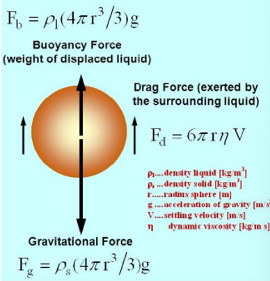

When a spherical ball of (radius r) is dropped in a viscous field it moves in it with certain velocity ‘ν’ (say) it experiences an opposing force (viscous force Fd). According to Stoke’s law this viscous force is given by   

Fd = 6πηrv   

Simultaneously it experiences an upthrust (or buoyant force) 𝐹𝑏 and gravitational force 𝐹𝑔. 𝐹𝑔 tries to increase the velocity of ball whereas Fd decreases the velocity. After some time the ball will move with a steady velocity, called the terminal velocity. Under the steady condition. 

 